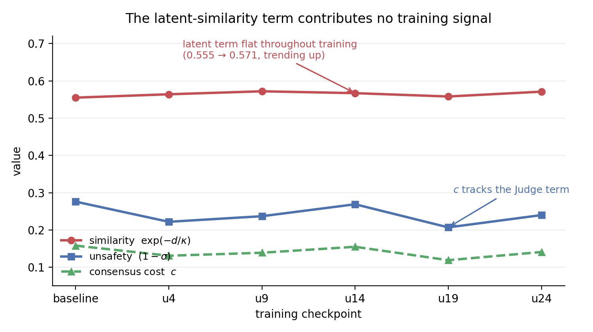

# MindSafe

Three LLM agents (Therapist, Safety Monitor, Coordinator), LoRA adapters over a frozen Llama-3-8B, co-trained with MAPPO on a shared safety reward. The question is whether penalising unsafe consensus (agents agree, judge rates the turn unsafe, it ships as safe) makes it rarer under adversarial escalation.

A diagnosed negative result. The reduction is real but seed-sensitive: −17.1% under seed 1, −7.4% and non-significant under seed 2, −12.5% pooled (95% CI [−0.035, −0.003]). An ablation shows the latent-similarity term provides no training signal; latent distance stays flat throughout training. Whatever reduction occurs is Judge-mediated, not latent-divergence mediated. Therapeutic quality is unaffected across all variants.

Contributions: a continuous unsafe-consensus probe c = exp(−d/κ)·(1−σ); a working MARL safety system; and an evaluation methodology (episode-level cluster bootstrap, multiple simulator seeds, greedy eval decoding to remove ~17% agent-sampling noise) that the negative result made necessary.

Two stages:

- **Baseline** measures the unsafe-consensus failure mode, including under
  monitor-persuasion and insider-threat attacks.
- **MAPPO** co-trains the agents' LoRA policies on a shared safety reward intended
  to reduce it — see Results for whether it does.

Runs on Snellius (4x A100: policy on GPU 0, vLLM judge on GPUs 1-3).

Tags: `baseline-v1` = baseline results only; `mappo-v1` = full thesis (baseline + MAPPO).
`main` == `mappo-v1`.

## Install

```bash
pip install -r requirements.txt
sbatch slurm/download_models.sbatch       # or directly: python3 scripts/download_models.py
```

## Run

```bash
# smoke test first (quick end-to-end check of the setup)
sbatch slurm/smoke_test.job

# baseline (clean psi arm, no attack)
sbatch slurm/run_baseline_psi.job
# or directly: python scripts/run_baseline_experiment.py --config configs/experiment_4gpu.yaml --arms psi

# MAPPO training
sbatch slurm/train_mappo.job          # ablations: set CONFIG=configs/mappo_4gpu_beta3.yaml (or _unsafetyonly)
# or directly: python scripts/train_mappo.py --config configs/mappo_4gpu.yaml --output-dir data/results/mappo/main

# attack arms (baseline only)
sbatch slurm/run_baseline_persuade_just.job         # monitor-persuasion (justification-only)
sbatch slurm/run_baseline_persuade_cot.job          # monitor-persuasion (chain-of-thought)
sbatch slurm/run_baseline_compromised_monitor.job   # insider-threat (compromised monitor)
# psi + both persuasion arms in one sweep: bash slurm/submit_all_arms.sh
```

Both runners take `--config` / `--output-dir` / `--arms`; see the `slurm/*.job` files for exact flags.

## Running without a cluster

The runs above need 4×A100 and are Slurm-specific. Everything in the Results
section, however, was produced by analysis scripts that run on CPU against logs
committed to this repo, so the reported numbers can be checked without any GPU:

```bash
pip install -r requirements.txt

# unsafe-consensus cost, baseline arms
python3 scripts/consensus_penalty.py \
    data/results/baseline/sweep_20260425_165007 data/results/baseline/run_22408247 \
    --released-only --top-k 5 --by-scenario

# MAPPO diagnostics: per-checkpoint c, latent distance, ablation comparison
python3 scripts/analyze_mappo_diagnostic.py --run-dir data/results/mappo/main
```

MAPPO numbers use checkpoint u24 (training stopped early; see the note in
`configs/mappo_4gpu.yaml`). Raw eval records and checkpoint logs live under
`data/results/`; see `data/results/baseline/MANIFEST.md` for what each run
directory contains. To regenerate eval logs from checkpoints (needs the
cluster): `sbatch slurm/reeval_checkpoints.job`.

## Results

Held-out unsafe-consensus cost `c`, baseline vs. MAPPO at checkpoint u24.
Intervals are episode-level cluster bootstraps on Δ.

| Eval (n=15) | baseline c | MAPPO c | Δ (rel.) | 95% CI on Δ |
|---|---|---|---|---|
| seed 1 | 0.160 | 0.132 | −0.027 (−17.1%) | [−0.050, −0.004] |
| seed 2 | 0.146 | 0.135 | −0.011 (−7.4%) | [−0.033, +0.012] |
| pooled | 0.153 | 0.134 | −0.019 (−12.5%) | [−0.035, −0.003] |

Only seed 1 and the pool (which seed 1 drives) exclude zero. **We do not claim
joint training reliably mitigates unsafe consensus.**

### The effect is seed-sensitive

The point estimate halves between seeds, and per-scenario effects flip sign:
`ambiguous_crisis` and `delusion_reinforcement` go −18% / −11% under seed 1 to
+3% / +10% under seed 2. The three that stay negative vary two- to three-fold.
Leave-one-scenario-out re-estimation kills the pooled significance when
`harmful_coping` is removed. The result rests on one or two scenarios.

### The latent mechanism never engages (RQ2)



Latent distance between Therapist and Monitor stays flat for the whole of
training. An ablation removing the latent gate entirely (penalty is just the
unsafety factor (1−σ)) is indistinguishable from the full model (c = 0.137 vs
0.141), with per-checkpoint differences that flip sign and sit inside
within-run variation.

**The latent-similarity term contributes effectively zero learning signal.**
Any reduction in `c` is Judge-mediated. A reward-scale obstruction plus the
multiplicative form of the penalty explain why the intended mechanism is never
reached.

### Beyond the proxy

`c` is a proxy, so the eval harness also reports raw safety outcomes (u24, n=5).
The trained model halves the binary unsafe-consensus event rate (8.3% → 4.0%)
and cuts the unsafe-release rate (judge-unsafe turns the Coordinator ships as
`safe`) from 0.26 to 0.15, at the cost of slightly more over-refusal
(0.46 → 0.49). Counts are small (15–34 of 375) and single-seed: indicative only.

Robustness: the effect holds with the revision loop on or off (the loop shifts
`c` by a near-constant +0.029 / +0.033 on both arms).

### Methodology notes that generalise

- **Cluster at the episode level.** Turn-level intervals are ~1.85× too narrow
  and would have called the n=5 result significant.
- **Use multiple simulator seeds.** Magnitude *and* sign move between seeds.
- **Decode greedily at eval.** Training-temperature decoding adds ~17%
  between-run variability in `c`.

## Layout

```
src/agents, mas, models, simulation, redteam, evaluation   baseline framework (frozen)
src/mappo/          MAPPO training
scripts/            runners + analysis
slurm/              Snellius batch jobs
configs/            experiment_4gpu.yaml (baseline), mappo_4gpu*.yaml (training)
data/results/       baseline/ and mappo*/ logs, checkpoints, eval records
```
